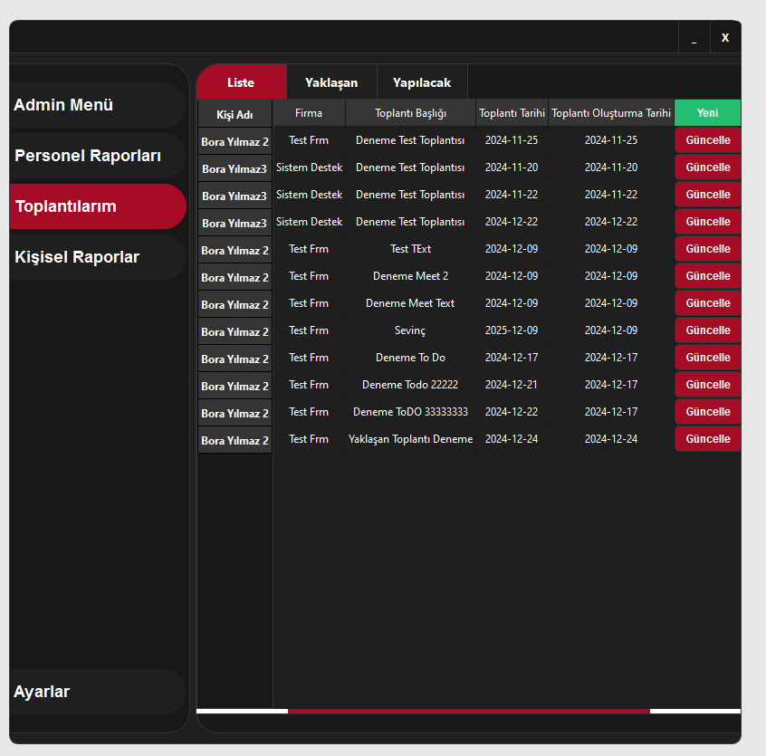
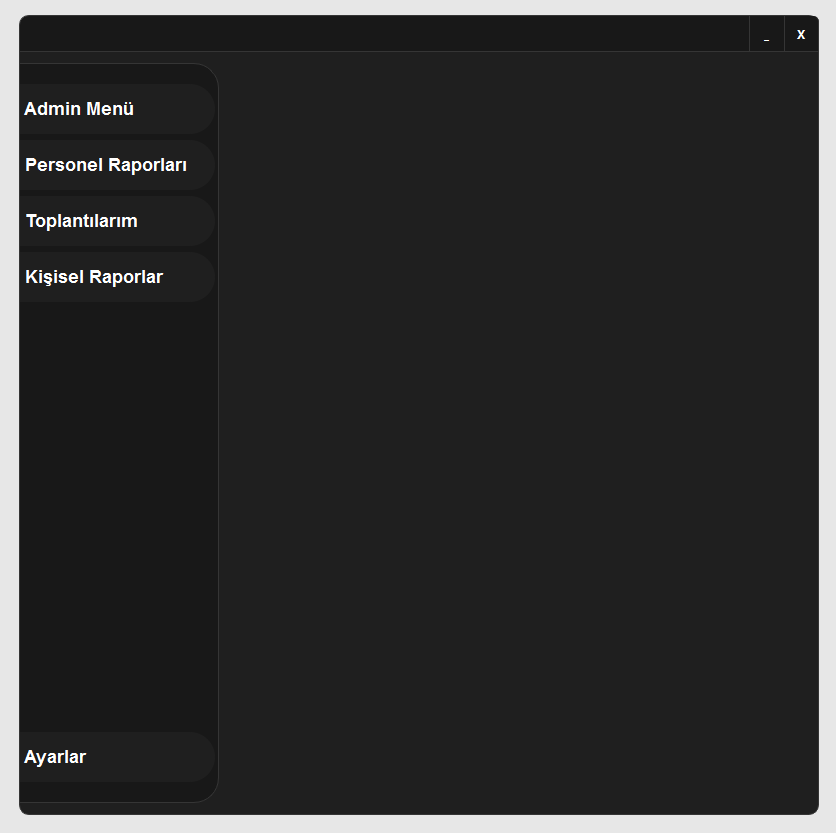
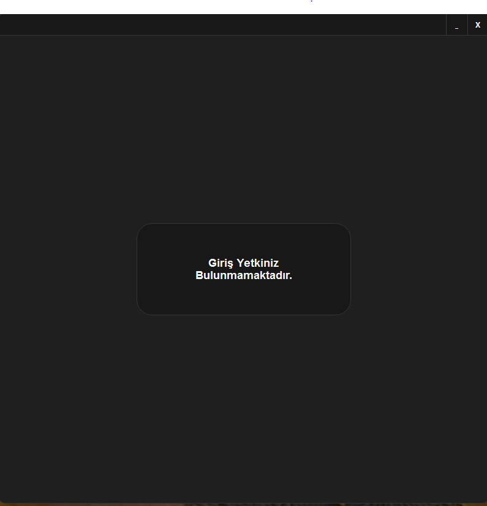
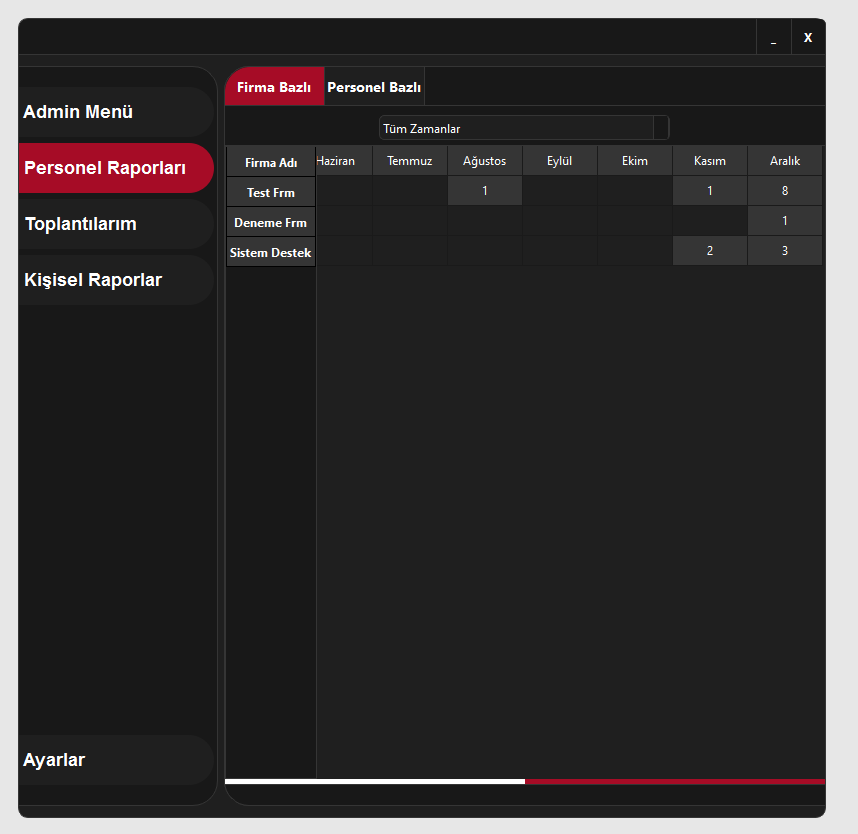
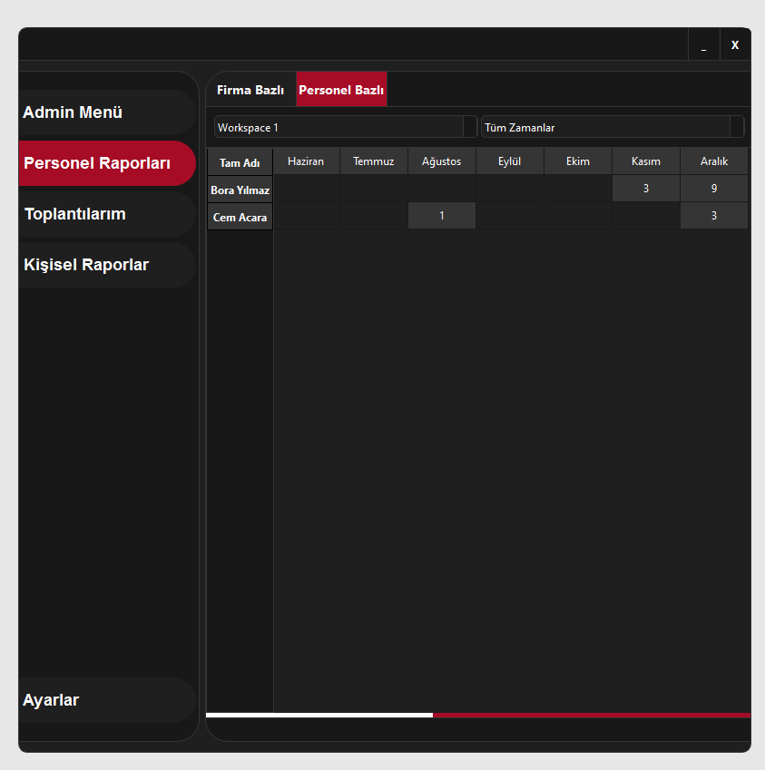
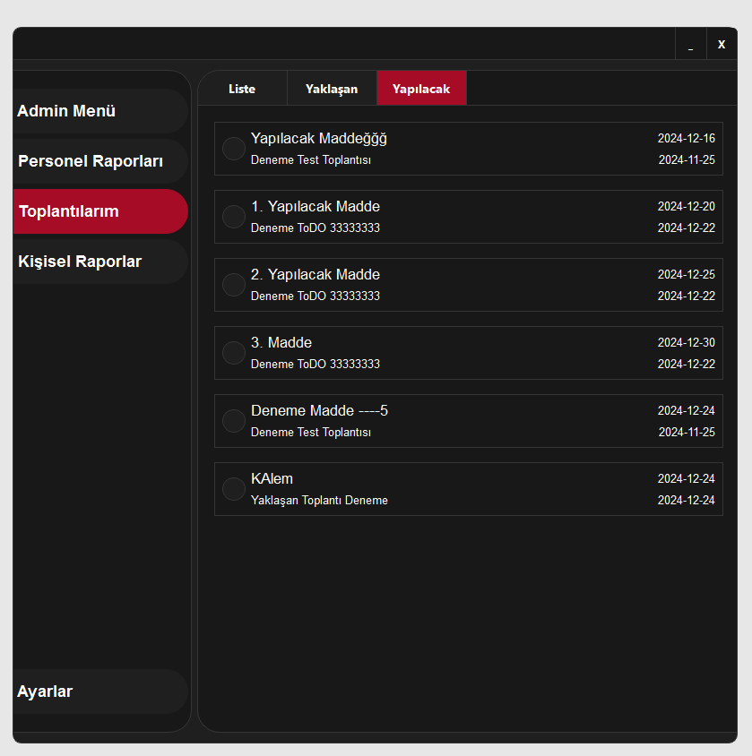
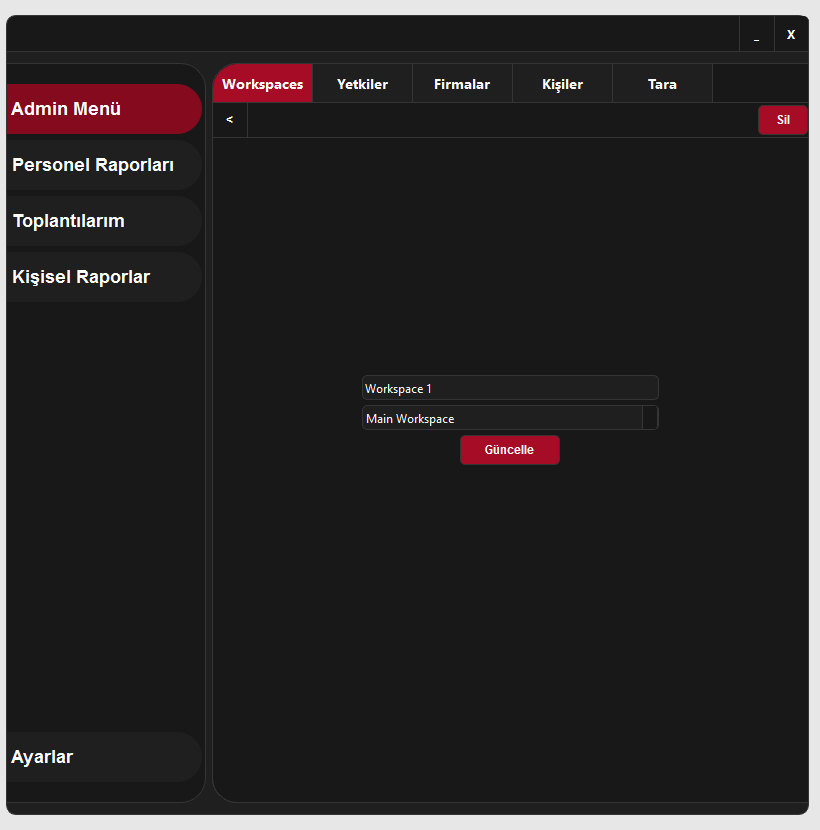
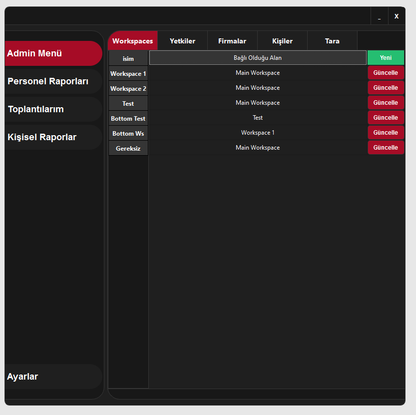

# Staff Note Management (SNM)

## 🇹🇷 Türkçe | 🇬🇧 English

Bu README hem Türkçe hem İngilizce açıklamalar içerir.

👉 [Türkçe](#-türkçe)  
👉 [English](#-english)

---

# 🇹🇷 Türkçe

## 📌 Proje Hakkında

**Staff Note Management (SNM)**, ekip üyelerinin gruplara ayrılmasını ve iş takibinin etkin şekilde yönetilmesini sağlayan bir yazılım çözümüdür.

Sistem MongoDB veritabanı kullanılarak geliştirilmiştir ve yerel ağ ortamında tanımlı kullanıcılara **güvenli ve şifresiz erişim** sağlayacak şekilde tasarlanmıştır.

Adminler tarafından oluşturulan çalışma alanlarına müdür ve personel eklenebilir. Eklenen personeller için alt çalışma alanları oluşturulabilir ve bu kişilere özel erişim alanları tanımlanabilir.

Ayrıca:

- Görüşme kayıtları  
- Yapılacaklar listeleri  
- Raporlama ekranları  

detaylı biçimde görüntülenebilir ve yönetilebilir.

---

## 🧠 Yetki Yapısı ve Güvenlik

Sistem rol bazlı bir mimari ile çalışır:

### 👑 Admin (Yönetici)
- Tüm kullanıcılar üzerinde tam yetkiye sahiptir.
- Çalışma alanları oluşturur.
- Müdür ve personel ekler.
- Raporları ve kayıtları görüntüler.

### 👔 Müdür
- Sadece kendi çalışma alanındaki verilere erişebilir.
- Bağlı personellerin kayıtlarını ve görevlerini inceleyebilir.

### 👤 Personel
- Kendi toplantılarını, görevlerini ve notlarını yönetir.

Bu yapı sayesinde her kullanıcı yalnızca kendi yetki alanındaki verilere erişir; böylece **güvenlik ve operasyonel verimlilik** artırılır.

---

## 🖥️ Sistem Nasıl Çalışır?

1. Kullanıcı yerel ağ üzerinden sisteme giriş yapar.
2. Kimlik doğrulama otomatik olarak gerçekleştirilir.
3. Kullanıcının rolüne göre menüler açılır.
4. Çalışma alanları ve alt alanlar üzerinden:
   - Toplantılar
   - Görevler
   - Raporlar
   yönetilir.

---

## 🖼️ Ekran Görüntüleri

Aşağıdaki alanlara proje görsellerini ekleyebilirsin:

1️⃣ **Toplantılarım Sekmesi**  

2️⃣ **Boş Menü**  

3️⃣ **Yetkisiz Giriş Ekranı**  

4️⃣ **Personel Raporları – Firma Bazlı Menü**  

5️⃣ **Personel Raporları – Personel Bazlı Menü**  

6️⃣ **Toplantılarım – Yapılacaklar Menüsü**  

7️⃣ **Admin Menü**  

8️⃣ **Admin Menü – İşlem Örneği**  

---

## 🎯 Kurumsal ve Eğitim Amaçlı Kullanım

Bu proje:

- Rol tabanlı erişim kontrolü
- Hiyerarşik ekip yapıları
- Kurumsal raporlama sistemleri
- Görev ve toplantı takibi
- Yerel ağ güvenliği

gibi kavramların uygulanmış bir örneğidir.

---

# 🇬🇧 English

## 📌 About the Project

**Staff Note Management (SNM)** is a software solution designed to organize teams into groups and manage task tracking efficiently.

The system was developed using a MongoDB database and is designed to provide **secure, passwordless access** to authenticated users within a local network.

Admins can create workspaces and assign managers and staff members to them. Sub-workspaces can be created for employees, with customized access permissions.

Additionally, the system allows detailed tracking of:

- Meeting records  
- To-do lists  
- Reports  

---

## 🧠 Authorization Structure and Security

The system uses a role-based architecture:

### 👑 Admin
- Has full control over all users.
- Creates workspaces.
- Assigns managers and staff.
- Views all reports and records.

### 👔 Manager
- Can access only the data within their own workspace.
- Reviews assigned staff activities and reports.

### 👤 Staff
- Manages only their own meetings, tasks and notes.

This structure ensures that each user can access only authorized information, improving both **security and operational efficiency**.

---

## 🖥️ How the System Works

1. User logs into the system from the local network.
2. Identity is automatically verified.
3. Menus are displayed based on the user role.
4. Meetings, tasks and reports are managed inside workspaces and sub-workspaces.

---

## 🖼️ Screenshots

Place your screenshots in the sections below:

1️⃣ **My Meetings Tab**  

2️⃣ **Empty Menu**  

3️⃣ **Unauthorized Access Screen**  

4️⃣ **Personnel Reports – Company Menu**  

5️⃣ **Personnel Reports – Employee Menu**  

6️⃣ **My Meetings – To-Do Menu**  

7️⃣ **Admin Menu**  

8️⃣ **Admin Menu – Action Example**  

---

## 🎯 Corporate and Educational Value

This project demonstrates:

- Role-based access control
- Hierarchical team management
- Enterprise reporting structures
- Task and meeting tracking
- Secure local-network systems

---
